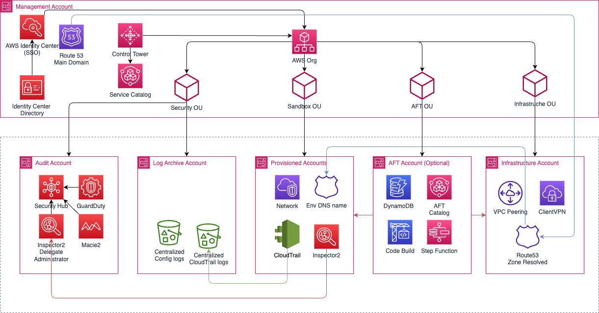
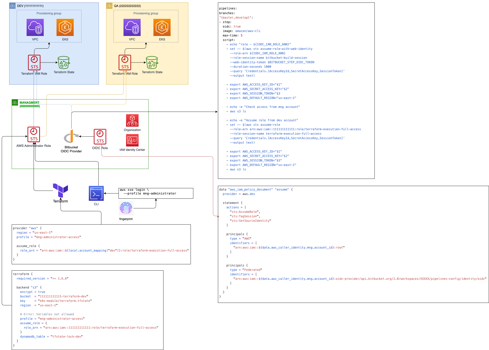

<h1 align="center">Hi 👋, I'm Yurii</h1>
<h3 align="center">A passionate Senior DevOps Engineer from Ukraine</h3>

  

- 🌱 I’m currently learning **AWS Certified Solution Architect topics**

- 📝 I sometimes write code on the **AWS Well-Architected Framework and SOC1 & SOC2 compliance** for my aws homelab

- 📫 How to reach me **yurii.furko@gmail.com**

- 📄 Know about my experiences [https://www.linkedin.com/in/yurii-furko-a0408953/](https://www.linkedin.com/in/yurii-furko-a0408953/)

- ⚡ Fun fact **Sometime i play chess at https://www.chess.com**

<h3 align="left">Connect with me:</h3>

<h3 align="left">Languages and Tools:</h3>

                  

## View my verified badges

### 🏠 My AWS HomeLab Architecture

### 🏠 Cross-Account access via OIDC and IAM role

#### 👷 Check out what I'm currently working on

- [yuriifurko/tf-aws-eks-magento2](https://github.com/yuriifurko/tf-aws-eks-magento2) -  (1 day ago)
- [yuriifurko/tf-aws-two-tier-architecture](https://github.com/yuriifurko/tf-aws-two-tier-architecture) -  (2 days ago)

#### 🌱 My latest projects

- [yuriifurko/tf-aws-eks-magento2](https://github.com/yuriifurko/tf-aws-eks-magento2) - 
- [yuriifurko/tf-aws-two-tier-architecture](https://github.com/yuriifurko/tf-aws-two-tier-architecture) - 

<h3 align="left">Support:</h3>

  

